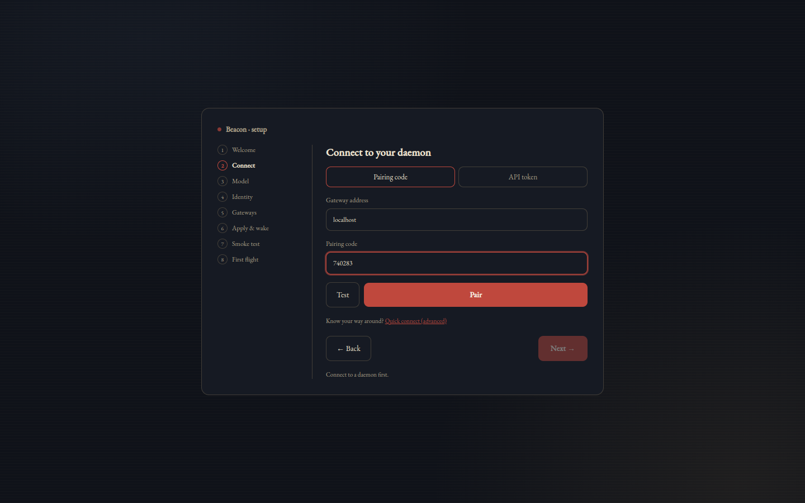
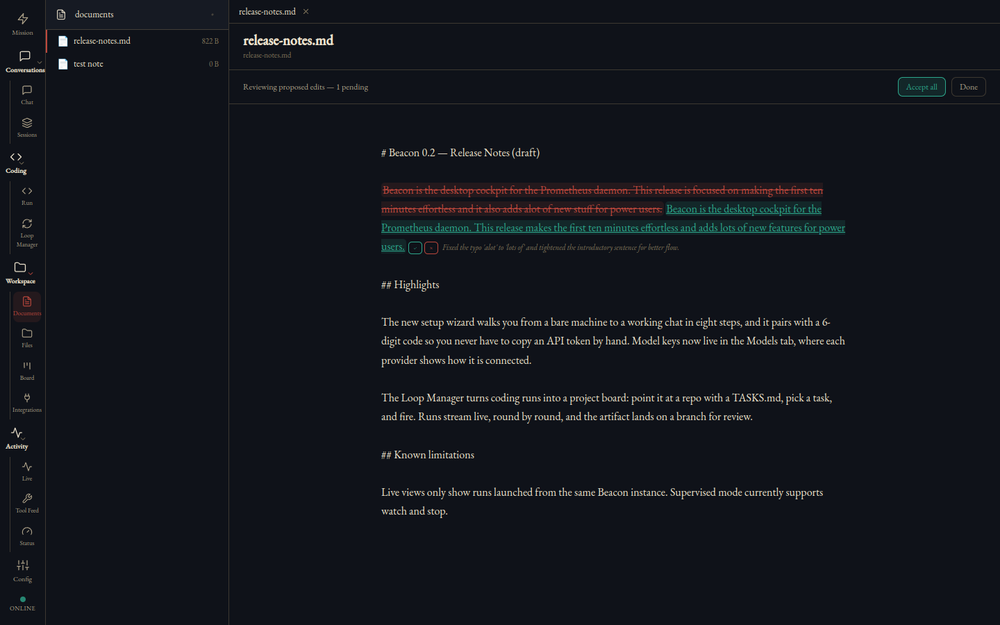

# Beacon

**The desktop cockpit for [Prometheus](https://github.com/OAraLabs/Prometheus)**, an AI agent daemon that runs on hardware you own.

Beacon is a client, not a backend. It holds no model and no model keys; your Prometheus daemon does the work and stays the source of truth. Beacon gives you one window onto it: chat with a live tool timeline, coding runs with their diffs, documents with proposed edits, and the daemon's activity as it happens. It works the same whether the daemon runs on this machine or across your LAN or tailnet.


This repository holds Beacon's installers and update feed. The source is not published here.

## Download

Get the newest build from **[Releases → Latest](https://github.com/OAraLabs/beacon/releases/latest)**.

| Platform | File | Install |
|---|---|---|
| macOS, Apple Silicon | `Beacon-<version>-arm64.dmg` | Open the disk image and drag Beacon to Applications. |
| Linux, x86_64 (any distro) | `Beacon-<version>-x86_64.AppImage` | `chmod +x Beacon-*.AppImage && ./Beacon-*.AppImage` |
| Debian / Ubuntu, amd64 | `Beacon-<version>-amd64.deb` | `sudo apt install ./Beacon-*.deb` |

Intel Macs and Windows are not built.

Once installed, Beacon keeps itself up to date from this repository. It checks about 30 seconds after launch and every 4 hours after that, downloads a new version in the background, and installs it when you quit. To install sooner, use **Settings → Updates → Restart & install**; **Check for updates** in the same place checks now. The macOS app and the AppImage update themselves. The `.deb` does not, so install new versions of it from Releases.

## Requirements

- **A Prometheus daemon** that Beacon can reach, on this machine or another one on your network:

  ```sh
  brew install oaralabs/tap/oara
  ```

  or

  ```sh
  pip install oara-prometheus
  ```

- **Network access to the daemon on ports 8005 (REST) and 8010 (WebSocket).** Setup always connects on these two ports, and ignores any port typed into the address.
- **macOS on Apple Silicon**, or **64-bit x86 Linux**.

## Connect Beacon to your daemon



### First time: pair with a code

1. **Start the daemon** on the machine that will run it:

   ```sh
   oara daemon
   ```

   With no configuration yet, it starts in **setup mode** and prints a banner, once, with a **6-digit pairing code**. The code is valid for 15 minutes, for one client, with 5 tries. If it expires or locks, restart `oara daemon` to get a new one. Beacon's screens call this command `prometheus daemon`, the older name, which still works.

2. **Open Beacon.** On first launch it opens setup: *Welcome · Connect · Model · Identity · Gateways · Apply & wake · Smoke test · First flight*.

3. **Connect.** Stay on the **Pairing code** tab and fill in:
   - **Gateway address**: the daemon machine's host name, Tailscale name or LAN IP. The banner prints its host name. Use `localhost` if the daemon runs on this machine.
   - **Pairing code**: the 6 digits from the banner.

   **Test** is optional and checks the address. **Pair** connects. The address is stored on this computer. The token the daemon sends back is encrypted with your OS keychain. On Linux with no keyring service running, Beacon falls back to Electron's `basic_text` storage, which uses a fixed key and does not protect the token from anyone who can read your files.

4. **Finish setting up the daemon from Beacon.** You don't need its terminal for this.
   - **Model**: Beacon asks the daemon to look for a local model server: llama.cpp, Ollama, LM Studio or vLLM. If none answers, start one (for example `ollama serve`) and choose **Re-detect**, or enter a custom URL. Cloud models appear only if your daemon offers them.
   - **Identity**: name your agent and give it a persona.
   - **Gateways**: connect Telegram, Slack or Discord now, or choose **Skip all — chat from Beacon only for now**.
   - **Apply & wake**: writes the configuration and waits, for up to 3 minutes, for the daemon to come up.
   - **Smoke test**: sends a real test message and waits for the reply.
   - **First flight**: choose **Enter Beacon**.

### Daemon already set up: use its API token

On the **Connect** step, open the **API token** tab and enter the gateway address and the daemon's API token (its `PROMETHEUS_API_TOKEN`). Leave the token blank if your daemon has none set. Choose **Connect**. Setup skips the steps your daemon has already done.

If a daemon is still in setup mode, it refuses a token, and Beacon asks for the pairing code instead.

### Later

To change the address or token, open **Settings…** (`⌘,` on macOS) to reach **Connection Settings**.

## A look inside




## Reporting problems

- **Bugs:** [open an issue](https://github.com/OAraLabs/beacon/issues/new/choose). The form asks for your version, OS and the steps you took.
- **Security issues:** please don't open a public issue. See [SECURITY.md](SECURITY.md).

## License

Beacon is free to download and use. It is not open source, and redistribution and reverse engineering are not permitted. See [LICENSE](LICENSE).
