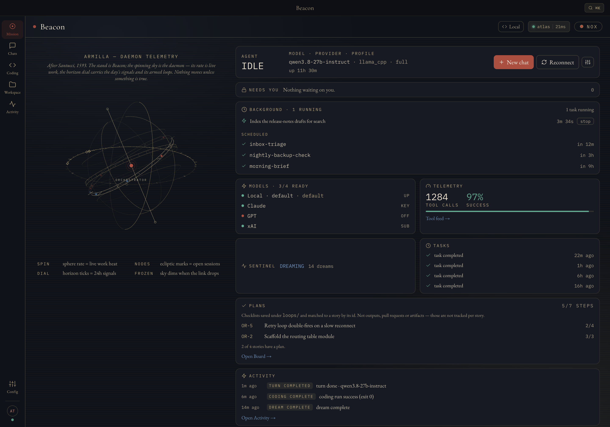
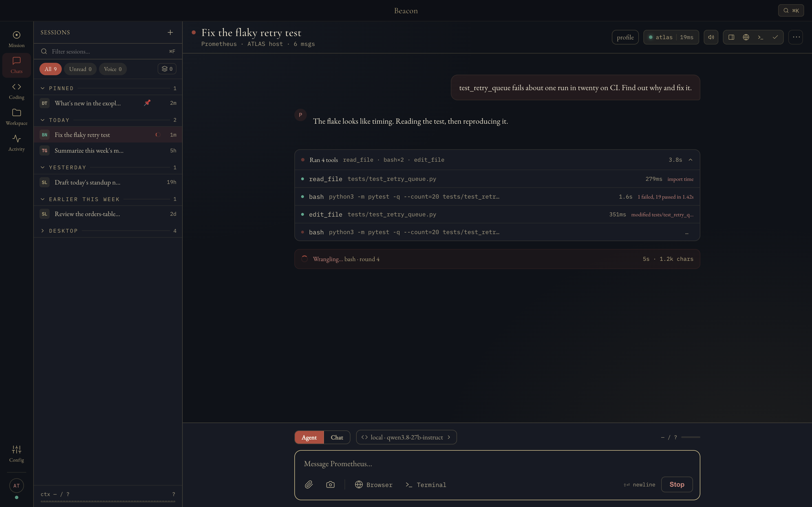
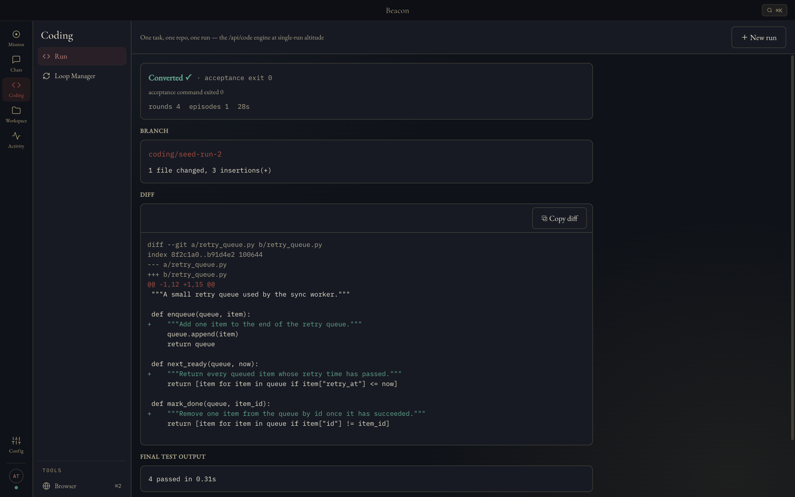

# Beacon

**The desktop cockpit for [Prometheus](https://github.com/OAraLabs/Prometheus), an AI agent that runs on hardware you own.** Chat with your agent and watch every tool call as it happens, launch coding runs and review their diffs, and keep an eye on the daemon from one window. Beacon holds no model and no model keys: your Prometheus daemon does the work, on this machine or anywhere on your network.

## Download

Get the newest build from **[Releases → Latest](https://github.com/OAraLabs/beacon/releases/latest)**.

| Platform | File |
|---|---|
| macOS, Apple Silicon | `Beacon-<version>-arm64.dmg`: open it and drag Beacon to Applications |
| Linux, x86_64 | `Beacon-<version>-x86_64.AppImage`: `chmod +x` it and run it |
| Debian / Ubuntu, amd64 | `Beacon-<version>-amd64.deb`: `sudo apt install ./Beacon-*.deb` |

The macOS app is signed and notarized. Beacon updates itself from this repository; see [updates](docs/SETUP.md#updates).

## Requirements

- A **Prometheus daemon** that Beacon can reach, on this machine or another one on your LAN or tailnet:
  `brew install oaralabs/tap/oara` or `pip install oara-prometheus`.
- Ports **8005** and **8010** open from Beacon to the daemon.
- macOS on Apple Silicon, or 64-bit x86 Linux.

## Connect in 3 steps

1. **Start the daemon** on its machine: `oara daemon`. The first time, it prints a 6-digit pairing code.
2. **Open Beacon** and, on the **Connect** step, enter that machine's address and the code. Choose **Pair**.
3. **Follow the setup** through model, identity and gateways. Beacon then wakes the daemon and sends a test message, and you're in.

Already have a configured daemon and its API token? Use the **API token** tab instead. [Setup in detail](docs/SETUP.md) covers both paths, updates, and troubleshooting.

<table>
  <tr>
    <td></td>
    <td></td>
  </tr>
</table>

## Help

- **Bugs:** [open an issue](https://github.com/OAraLabs/beacon/issues/new/choose).
- **Security:** please report privately, see [SECURITY.md](SECURITY.md).

## License

Free to use · closed source · beta. See [LICENSE](LICENSE).
