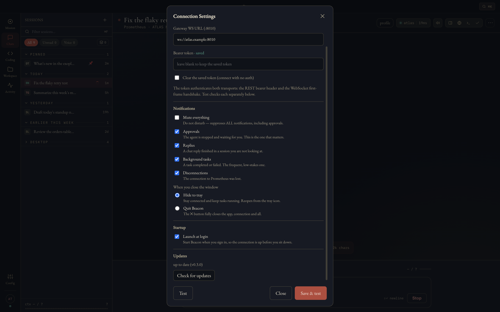

# Setting up Beacon

This page covers connecting Beacon to a Prometheus daemon in detail, how updates work, and what the common messages mean. For the short version, see the [README](../README.md#connect-in-3-steps).

## Before you start

- **A Prometheus daemon** that Beacon can reach:

  ```sh
  brew install oaralabs/tap/oara
  ```

  or

  ```sh
  pip install oara-prometheus
  ```

- **Ports 8005 (REST) and 8010 (WebSocket)** reachable from Beacon. Setup always connects on these two ports, and ignores any port typed into the address.
- **macOS on Apple Silicon**, or **64-bit x86 Linux**.

The daemon's command is `oara`. Older documentation and some Beacon versions say `prometheus daemon` and `prometheus setup`: `prometheus` is still an alias for `oara`, so either works.

## First time: pair with a code


1. **Start the daemon** on the machine that will run it:

   ```sh
   oara daemon
   ```

   With no configuration yet, it starts in **setup mode** and prints a banner, once, with a **6-digit pairing code**. The code is valid for 15 minutes, for one client, with 5 tries. If it expires or locks, restart `oara daemon` to get a new one.

2. **Open Beacon.** On first launch it opens setup: *Welcome · Connect · Model · Identity · Gateways · Apply & wake · Smoke test · First flight*.

3. **Connect.** On the **Pairing code** tab, fill in:
   - **Gateway address**: the daemon machine's host name, Tailscale name or LAN IP. Use `localhost` if the daemon runs on this machine.
   - **Pairing code**: the 6 digits from the banner.

   **Test** is optional and checks the address. **Pair** connects.

4. **Finish setting up the daemon from Beacon.** You don't need the daemon's terminal for this.
   - **Model**: Beacon asks the daemon to look for a local model server: llama.cpp, Ollama, LM Studio or vLLM. If none answers, start one (for example `ollama serve`) and choose **Re-detect**, or enter a custom URL. Cloud models appear only if your daemon offers them.
   - **Identity**: name your agent and give it a persona.
   - **Gateways**: connect Telegram, Slack or Discord, or choose **Skip all — chat from Beacon only for now**. You can add one later with `oara setup --gateway-only` on the daemon.
   - **Apply & wake**: writes the configuration and waits, for up to 3 minutes, for the daemon to come up.
   - **Smoke test**: sends a real test message and waits for the reply.
   - **First flight**: choose **Enter Beacon**.

## Daemon already set up: use its API token

On the **Connect** step, open the **API token** tab and enter the gateway address and the daemon's API token (its `PROMETHEUS_API_TOKEN`). Leave the token blank if your daemon has none set. Choose **Connect**. Setup skips the steps your daemon has already done.

If a daemon is still in setup mode, it refuses a token, and Beacon asks for the pairing code instead.

## Changing the connection later

Open **Settings…** (`⌘,` on macOS) to reach **Connection Settings**, where you can change the gateway URLs and the token.

## Where your credentials go

The address is stored on this computer. The token the daemon sends back when you pair (or the one you enter) is encrypted with your OS keychain. On Linux with no keyring service running, Beacon falls back to Electron's `basic_text` storage, which uses a fixed key and does not protect the token from anyone who can read your files.

## Updates



Beacon keeps itself up to date from this repository's releases. It checks about 30 seconds after launch and every 4 hours after that, downloads a new version in the background, and installs it when you quit. In **Settings → Updates** you can check now with **Check for updates**, and install a downloaded update straight away with **Restart & install**.

The macOS app and the AppImage update themselves. The `.deb` does not; install new versions of it from [Releases](https://github.com/OAraLabs/beacon/releases).

## When something goes wrong

| Beacon says | What to do |
|---|---|
| Nothing answered at that address — check the host and that the daemon is running. | Check the address, that `oara daemon` is running, and that ports 8005 and 8010 are reachable from this computer. |
| This daemon is in SETUP MODE — pair with the 6-digit code from its terminal. | Use the **Pairing code** tab with the code from the daemon's banner. |
| The daemon answered but rejected the token — check it (or pair with a code). | Re-enter the token, or pair with a code instead. |
| Wrong pairing code — N attempts remaining | Re-type the 6 digits from the banner. |
| Pairing locked (too many attempts), Pairing code expired, or That code was already used | Restart `oara daemon` on its machine for a new code. |
| The daemon never answered /api/status — check its terminal for errors. | Look at the daemon's terminal output; it failed to come up with the new configuration. |
| No reply within two minutes — the model may still be loading. | Wait and retry the smoke test, or continue and try chatting later. |

Still stuck? [Open an issue](https://github.com/OAraLabs/beacon/issues/new/choose); the form says what to include.
